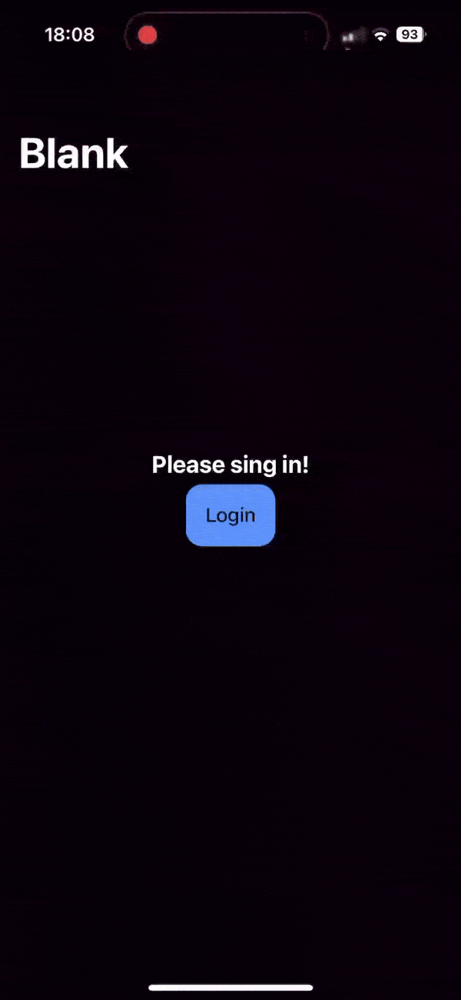

# Capacitor Keycloak-JS Authentication implementation with In-App Browser

<div style="display: flex">



</div>
<br />

## Why Does This Exist?

I searched high and low for a simple project that integrates Keycloak authentication with Capacitor and InAppBrowser to bootstrap my project idea, but guess what? I couldn't find exactly what I needed. So, I rolled up my sleeves and built it myself! 😎

## What Is This?

This is a straightforward yet powerful implementation of Keycloak authentication for Capacitor-based apps. Built with the latest technologies, this project is designed to be your go-to starting point. Whether you're building a new app or adding authentication to an existing one, this package lets you hit the ground running with Keycloak authentication all set up and ready to go!

## Why You'll Love It

- **Modern Tech:** Leveraging the latest web and mobile technologies for a seamless experience.
- **Quick Start:** Fork this repo, and you’ve got a ready-made foundation for your next app idea.
- **Cross-Platform:** Works like a charm on iOS, Android, and the web.
- **Secure & Flexible:** Built with security in mind, with plenty of room for customization.

## Features

- ✅ **Login:** Securely authenticate users in your app.
- ✅ **Logout:** Safely log users out, ending their session.
- ⬜ **Register:** (Coming Soon) Allow new users to create accounts directly from the app. *(Note: Currently possible via the login form, but buggy on mobile)*

## Known Issues

- The built-in Keycloak instance in `keycloak-js` seems buggy; the `createLoginUrl`, `createLogoutUrl`, and `createRegisterUrl` functions always modify the `redirectUri` even if you pass this field within the object:

  

## Getting Started

### Prerequisites

- Node.js and npm installed.
- Ionic CLI installed (For the predefined scripts).
- Capacitor project set up (or just fork this one!).
- A Keycloak server with your realm and client configured.

### For Android Version:

- Android Studio installed.

### For iOS Version:

- A MacBook or Mac Mini.
- Xcode installed.

### Installation

1. **Fork this repo:** Start by forking this repository so you can use it as the base for your own project.

2. **Install dependencies:**

   ```bash
   npm install

3. **Run predefined scripts depending on your desired platform:**
   ```bash
   npm run build:web
   npm run build:android
   npm run build:ios

### Configuration

1. **Fill out `environment.ts`:** Alternatively, you can create your own `dev` environment file. If you do, the `build:web` script can be used to replace the content of `environment.ts`.

2. **Configure Android deep linking:**

   Update the Android configuration file for deep linking located at `android/config.properties`. Alternatively, you can create your own file named `config.local.properties`.

3. **Configure iOS URL types:**

   Modify the `CFBundleURLTypes` section in the `ios/App/App/Info.plist` file.  
   **Note:** It is currently configured to listen for the `myapp` app link.


## 🌟 Why Your Star ⭐ and Fork 🍴 Matter

Hey there! If you've found this project helpful, useful, or even just a little bit interesting, consider giving it a star ⭐. It might seem like a small thing, but it means a lot!

### Here's why:

- **Boosts Visibility 🚀:** Each star helps others discover this project, allowing it to reach more developers who might benefit from it.
- **Shows Appreciation 🙌:** Your star is a way of saying "Thanks!" and it motivates me to keep improving the project.
- **Encourages Contributions 🤝:** A starred project attracts more attention, and with that comes potential contributors who can help make the project even better.
- **Builds Community 🌍:** Forking the repo 🍴 not only helps you start your own awesome project but also helps build a network of developers who can share ideas, report issues, and collaborate.

So, if you like what you see, hit that star button up top! And if you're feeling extra adventurous, fork the repo and make it your own. Your support is what keeps this project alive and kicking! 💪

Thanks for being awesome! 😄


---

### Final Thoughts

Alright, I’ll admit it—frontend development isn’t exactly my superpower. But I did my best to keep everything as clear and organized as possible! 😅 If you have any improvements, suggestions, or just want to help make this project even better, I’m all ears. Pull requests are more than welcome—bring them on! 🚀
